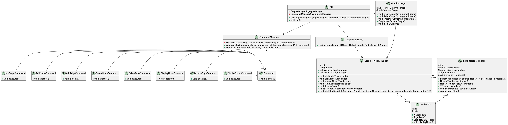

# Data Collector for RAG

This project is a Data Collector system built for the RAG (Retrieval-Augmented Generation). It is designed to gather, manage, and process data that can be used for Retrieval-Augmented Generation tasks.
RAG combines information retrieval with large language models to improve the quality and relevance of generated content.
The system uses graph-based structures to represent and manage data, enabling advanced analytics and retrieval capabilities.

## Overview

- [Key Principles](#key-principles)
- [Run project](#run-project)
- [Class diagram](#class-diagram)
- [What Was Used in the Project](#what-was-used-in-the-project)
- [What Has Been Done in the Project](#what-has-been-done-in-the-project)
- [Achievements](#achievements)
- [Future Steps](#future-steps)

## Key Principles

1. **Minimalism and Simplicity:**
   The system follows the minimalism principle by avoiding unnecessary complexity in the hierarchy and structure of the knowledge base. The focus is on keeping things simple, efficient, and straightforward to use. The goal is to prevent over-complication of data relationships and structure, ensuring that the user can easily manage and understand their data without feeling overwhelmed by the system’s design.

2. **Adding Metadata and Tags to Notes:**
   This system provides the ability to attach metadata and tags to pieces of information, such as notes or documents, allowing for a more structured and categorized data storage approach. This feature is useful for enhancing the retrieval process by offering extra context and classification to the data, making it easier to search, organize, and understand the content.

3. **Data Storage and Vector Store Creation:**
   The system supports saving data as files to generate a vector store from the saved data. This means that after collecting and organizing information in the system, you can easily export it as a file. Additionally, the system can create a vector store from these files, allowing for more efficient and relevant data retrieval in RAG tasks. The vector store provides an efficient structure for querying and augmenting generative models with relevant content.

4. **Explicit Relationships Between Information Pieces:**
   One of the core features of this system is the ability to explicitly define relationships between different pieces of information. Whether it's creating a link between documents, notes, or other data entities, the system allows you to mark and visualize these connections clearly. This functionality is vital for creating a knowledge graph where relationships between entities (nodes) are crucial for data retrieval and context in RAG models.

## Run project

Here's the detailed documentation on how to build and run C++ code using CMake:

### Step 1: Install CMake

1. **On macOS**:

    ```sh
    brew install cmake
    ```

2. **On Ubuntu/Debian**:

    ```sh
    sudo apt update
    sudo apt install cmake
    ```

3. **On Windows**:
   - Download the installer from the official CMake website.
   - Install CMake by following the installer instructions.

### Step 2: Build the Project Using CMake

1. Navigate to the root directory.

2. Run the command to generate build files and build the project:

 ```bash
 cmake -S . -B build && cmake --build build
 ```

### Step 3: Run the Executable

After a successful build, an executable file named `app` will be created in the `build` folder. Run it with the following command:

```bash
./build/data_storage
```

### Full Command to Build and Run

```bash
cmake -S . -B build && cmake --build build && ./build/data_storage
```

### Run tests

```bash
cd build
ctest --output-on-failure
cd ..
```

### Rerun failed tests with all logs

```bash
ctest --rerun-failed --output-on-failure
```

## Class diagram



## What Was Used in the Project

Technologies & Tools:

- C++:

- The core logic of the project is implemented in C++ for high performance and efficiency.
CMake:

- CMake is used for building the project, managing dependencies, and generating platform-specific build configurations.
Google Test (gtest):

- For testing the functionality of different components, Google Test is used to ensure code quality and correctness.
Graph-based Data Structures:

- The system leverages graph-based data structures to represent relationships between various data entities. This is particularly important for enabling advanced data retrieval and building a knowledge graph for Retrieval-Augmented Generation (RAG).
Vector Store:

- Vector-based data structures are used to create efficient storage for large datasets, enhancing the ability to search and retrieve relevant data for RAG tasks.
Metadata and Tagging:

- The ability to attach metadata and tags to data pieces is implemented for better organization and retrieval. This feature allows for enhanced categorization and searchability.

## What Has Been Done in the Project

### Data Collection

- Graph-Based System:
A graph-based system for representing relationships between different pieces of data (notes, documents, etc.) has been created.
Nodes and edges are used to represent entities and relationships, respectively, making it easier to understand how data points are connected.

### Data Storage and Vector Store

- Vector Store Creation:
The system can save data to files to generate a vector store for efficient querying, making it suitable for large-scale RAG tasks.

### Metadata and Tagging

- Metadata and Tagging:
A feature was implemented that allows for attaching metadata and tags to individual data pieces. This ensures that each piece of information is not only easily retrievable but also properly categorized.

### Explicit Relationship Handling

- Explicit Relationships Between Entities:
The system enables the explicit definition of relationships between entities in the system, which improves the quality of data retrieval in tasks involving large language models.

### Testing

- Unit Testing:
Tests were created using Google Test to verify the correctness of different components, ensuring the integrity of the system.
Tests were created for functions such as adding nodes and edges, removing nodes, and handling metadata and tags.

## Achievements

- Effective Data Representation:
A clean and efficient graph-based data model was implemented, which is easy to manage and understand.

- Robust Retrieval-Augmented Generation Framework:
The vector store and tagging features ensure that relevant data can be retrieved effectively to augment generative models, thus improving the quality of generated content.

- Scalable System:
The system is designed to handle growing amounts of data and can be scaled by adding more nodes, edges, and metadata, all while maintaining efficiency.

- Quality Assurance:
Comprehensive testing has been conducted to ensure that the system behaves as expected and remains stable under various conditions.

## Future Steps

- Integration with RAG Models:
The next step is to integrate this data collection and storage system with Retrieval-Augmented Generation models, enabling seamless use of stored data for generative tasks.

- Improvement of Metadata Handling:
Extend the metadata functionality by allowing more sophisticated tagging and categorization of data, such as hierarchical tags or multi-level metadata.

- Advanced Query Capabilities:
Develop more advanced query features to retrieve related data based on complex conditions or patterns, making the system even more powerful for RAG tasks.

- User Interface:
Add a simple graphical user interface (GUI) to make the system more user-friendly and provide a visual representation of the data graph and its relationships.

- Distributed Data Collection:
Implement distributed data collection capabilities to allow for collecting and managing data across multiple systems or nodes, enhancing scalability and fault tolerance.
